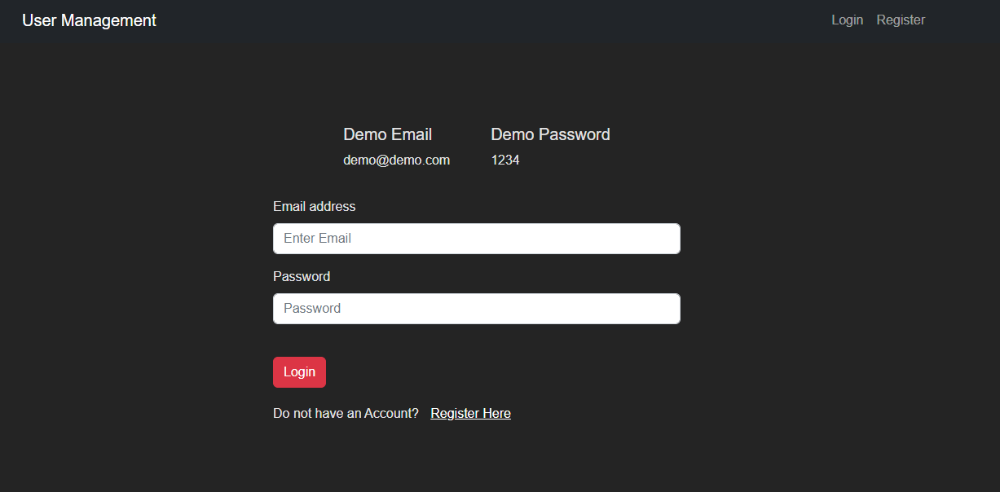
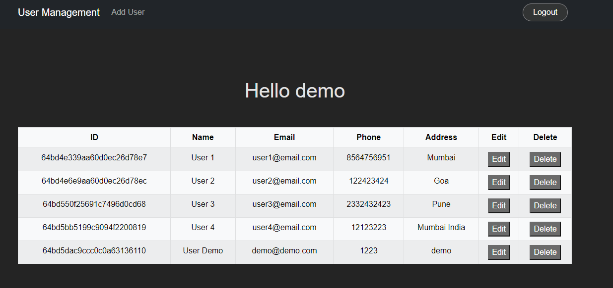
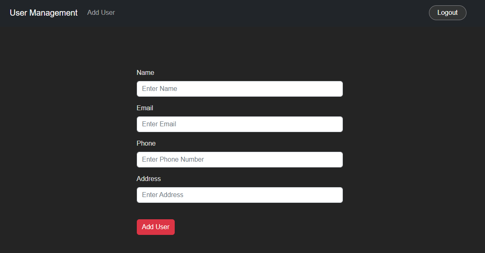
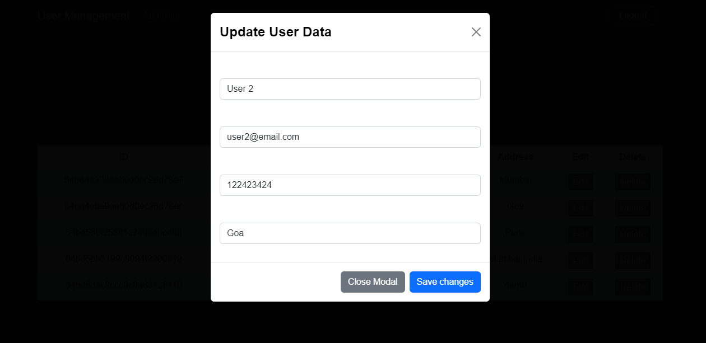

# MERN-SDP-Project

## User Management System

### **[View Demo](https://user-management-system-7maa.onrender.com)**

#### Demo Images

#### By going in Backend and Frontend Folder :
### npm install
#### then staying in root directory
### npm run dev
(this will concurrently start Client and Server)
